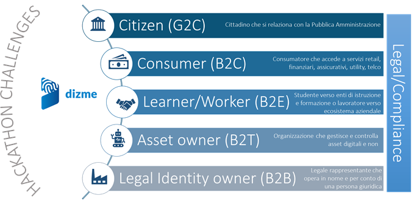
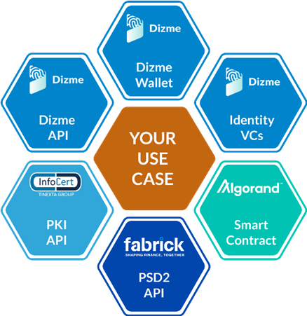

# Hackathon_21

## OBIETTIVO
Individuare idee originali e realizzare soluzioni innovative sul tema dell’**identità digitale decentralizzata** (*self sovereign identity*).

*Grazie ad HACKATHON_21, Dizme Foundation vuole promuovere lo sviluppo di un nuovo modello di identità che ci consenta di ottenere un reale controllo sui nostri dati e proteggere la nostra privacy.*

## A CHI E’ RIVOLTO? 
-	**Startup/PMI innovative**: interessate ad integrare il tema della self sovereign identity all’iterno dei loro servizi e/o prodotti
-	**Talenti - innovatori, singoli o in gruppo** – interessati a sviluppare e proporre idee sul tema della self sovereign identity
- **LegalTech** – studi legali e singoli professionisti - esperti di digital compliance che sceglieranno uno dei casi d’uso esistenti per sviluppare uno studio di fattibilità riguardo i vincoli normativi

## LE SFIDE 
Definite sui ruoli di identità di una persona o un’organizzazione

- Challenge G2C | Government to **Citizen** – soluzioni per il Cittadino che si relaziona con la Pubblica Amministrazione
- Challenge B2C | Business to **Consumer** – soluzioni per il Consumatore che accede a servizi retail, finanziari, assicurativi, utility, telco  
- Challenge B2E | Business to **Employee** – soluzioni per lo studente che si relaziona con enti di istruzione e formazione o per il lavoratore che interagisce con l’ecosistema aziendale
- Challenge B2B | Business to **Business** – soluzioni per il legale rappresentate che opera in nome e per conto di una persona giuridica
- Challenge B2T | Business to **Things** – soluzioni per il controllo e la gestione di asset digitali e non

### SCENARI D'USO

|Citizen G2C|Consumer B2C|Learner/Worker B2E |Asset owner B2T|Legal Identity owner B2B
|-----------|------------|-------------------|---------------|------------------------
|Emergenza Covid19: Certificazione esito test; Certificazione stato vaccinale; Consenso informato; Verifica anonima di esiti/stati|One click on-onboarding: no-integration; interazione multi-canale; Programma di affiliazione|Certificazione skill e competenze: Integrazione VC – OpenBadge; Pubblicazione profili su registro online |Gestione manutenzioni e ispezioni: Certificazione tecnici abilitati; Certificazione data-ora e geolocalizzazione |Contract Management:Integrazione business information; Esecuzione automatica del processo
|xx |Ottimizzazione processo KYC/AML: verifiche automatiche; Riuso attraversi condivisione credenziali certificate |Integrazione sistemi di autenticazione| Provisioning IOT: Certificazione proprietà; Pairing e accesso controllato |Voto assembleare: Segreto vs palese; Scrutinio pubblico, certificazione evidenze di voto
|xx |Certificazione reddituale: Numero telefonico; Busta paga, dichiarazione dei redditi |Innovazione processi di check-in| xx | xx
|xx |Sottoscrizione remota contratti: verifica identità	| xx |xx | xx
|xx |Marketing targeting GDPR Free: Comunicazione push in-wallet 	|xx |xx |xx
 			

## LA TECNOLOGIA 
I partecipanti potranno realizzare il proprio progetto innovativo facendo leva sulle componenti dell'ecosistema Dizme e sui servizi dei Partner Tecnologici. 

### Dizme Wallet 
Una mobile app per l'utente finale (*holder*) per il completo controllo delle proprie credenziali. Nel wallet digitale, protetto da un'autenticazione multi-fattore, le informazioni personali sono salvate sotto forma di Verifiable credential (formato standard W3C). 
> *Dizme wallet in stage environment è scaricabile nelle versioni iOS e Android.*

### Dizme API
Le API abilitanto i partecipanti ad interagire con i wallet per emettere e verificare Verifiable Credential secondo le esigenze a cui la Soluzione proposta si riferisce.
> *Dizme API sono pubblicate su [Dizme Developer Portal](https://www.dizme.io/developers)*; 
> *[Reference implementation](https://github.com/dizme/Foundation/tree/main/generic-organization)*

### Identity Verifiable Credentials
Verifiable Credentials per accelerare lo sviluppo delle Soluzioni sono disponibili all'interno del wallet per la verifica dell'identità di una persona fisica tramite selfie, liveness detection, riconoscimento documenti di identità, autenticazione SPID e autenticazione bancaria.

### InfoCert API
API di servizi InfoCert per realizzare Soluzioni che integrino processi di firma digitale avanzata (FEA) e firma digitale qualificata (FEQ). 

### Algorand Platform
Algorand mette a disposizione:
1.	Setting dei tool di sviluppo (nodo, docker sandbox, smart contract debugger, etc.);
2.	Algorand Standard Assets: proprietà e genesi di token su Algorand tramite CLI oppure SDK (Python);
3.	Algorand Smart Contracts: linguaggio TEAL, logica di sviluppo e debug sia per la versione Stateless che Stateful;
4.	SDK Python: gestione su back-end Python di creazione account, scrittura e firma transazioni, query dati in blockchain

### Fabrick API

